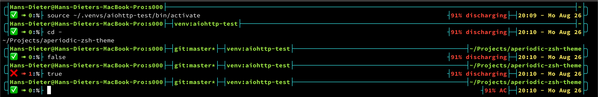

# aperiodic ZSH Theme

## Credits

This ZSH theme is based heavily on an excellent blog entry from [Phil Gold](http://aperiodic.net/phil/prompt/). In his blog entry Phil explains detailed how his ZSH theme is working and I can only strongly recommend it to everyone who wants to modify or even generate a new ZSH theme.

## Features

This ZSH theme has the following features (from left to right and from top to bottom):

- Indication of user, hostname & terminal. Enhanced visual indication if the user is root.
- Git branch and status.
- Activated Python virtual environment.
- Current Ruby interpreter (not shown in the screenshot).
- Current working directory.
- Visual indication of the shell return value.
- Numeric indication of the shell return value.
- Status of the power management.
- Time and date.

## Screenshot



## Installation

Put `aperiodic.zsh-theme` in your `~/.oh-my-zsh/custom/themes` directory, then in your `~/.zshrc` file:

```
ZSH_THEME="aperiodic"
```

